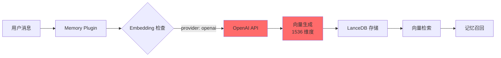
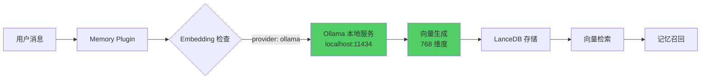
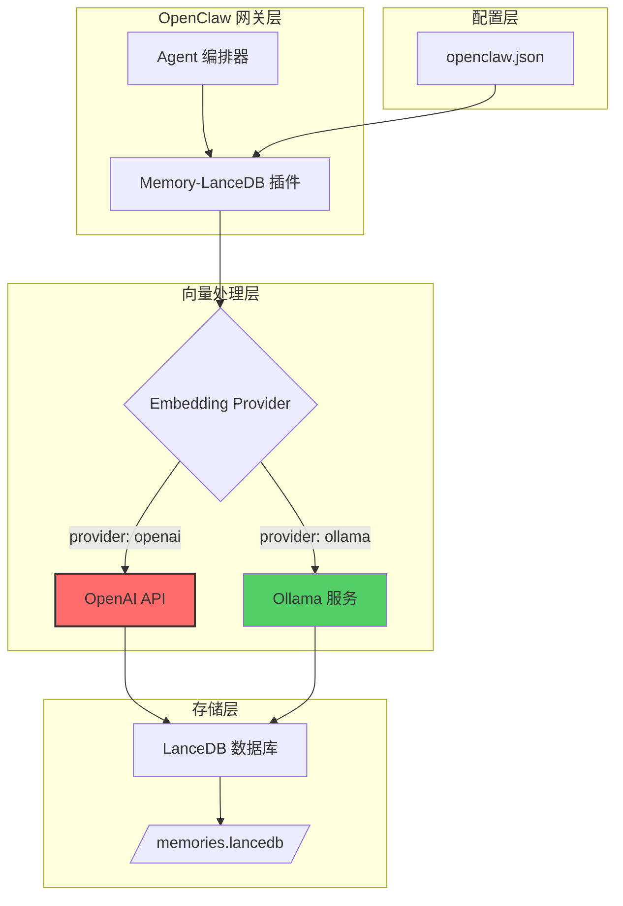
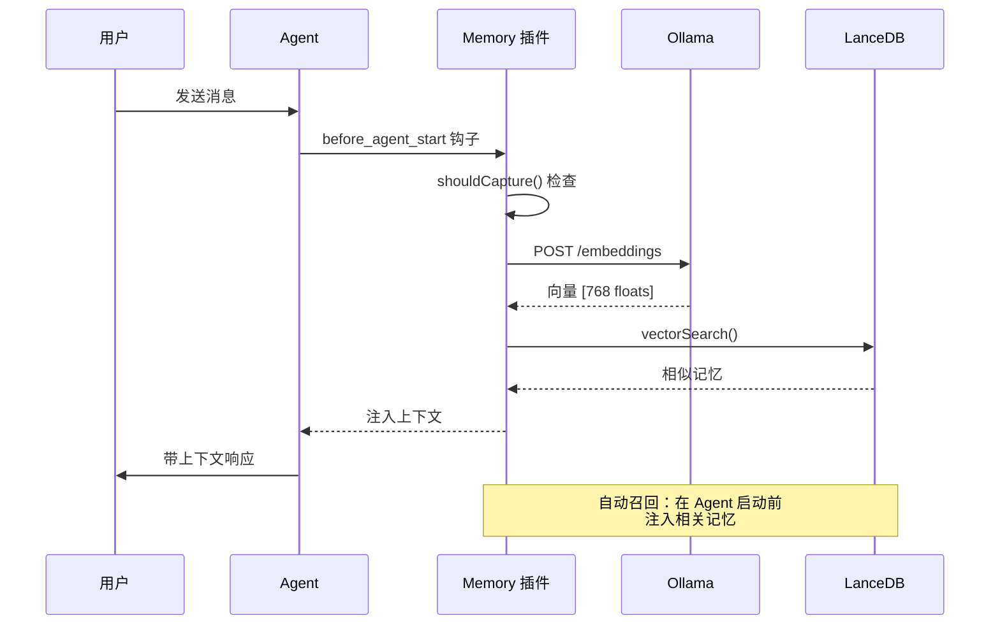

# 从 OpenAI 迁移到 Ollama：OpenClaw Memory-LanceDB 本地化改造指南

## 📋 目录

- [项目背景](#项目背景)
- [为什么需要迁移](#为什么需要迁移)
- [架构设计](#架构设计)
- [技术实现](#技术实现)
- [部署指南](#部署指南)
- [性能对比](#性能对比)
- [挑战与解决方案](#挑战与解决方案)
- [最佳实践](#最佳实践)
- [总结](#总结)

---

## 🎯 项目背景

[OpenClaw](https://github.com/anthropics/openclaw) 是一个强大的多通道 AI 网关，提供可扩展的消息集成能力。`memory-lancedb` 插件通过向量搜索为 AI 智能体提供长期记忆功能，使其能够在对话中记住和召回重要上下文。

默认情况下，该插件使用 OpenAI 的 embeddings API。本指南将详细介绍如何从付费的 OpenAI 方案迁移到免费的本地 Ollama 部署方案——在提升隐私和性能的同时消除 API 成本。

---

## 🤔 为什么需要迁移？

### OpenAI Embeddings 的局限性

| 问题 | 影响 |
|------|------|
| 💰 **成本问题** | API 调用费用累积迅速——每 100 万 tokens 约 $0.02，长期使用成本高昂 |
| 🔒 **隐私风险** | 所有对话数据都上传到 OpenAI 服务器 |
| 🌐 **网络依赖** | 完全依赖外部 API——无法离线使用 |
| ⏱️ **延迟问题** | 每次 embedding 都需要网络请求（约 200-500ms） |

### Ollama 迁移的优势

| 优势 | 描述 |
|------|------|
| ✅ **零成本** | 完全免费——无 API 费用 |
| 🔐 **隐私优先** | 所有处理都在本地完成 |
| 📴 **离线可用** | 无需互联网连接即可工作 |
| ⚡ **更低延迟** | 本地 embedding（约 50-100ms） |
| 🚀 **部署简单** | 一键安装配置 |

---

## 🏗️ 架构设计

### 原始架构（OpenAI）



### 迁移后架构（Ollama）



### 系统整体架构



### 数据流时序图



---

## 🔧 技术实现

### 1. 配置模式定义

**文件**: `config.ts`

```typescript
export type MemoryConfig = {
  embedding: {
    provider: "openai" | "ollama";
    model?: string;
    apiKey?: string;     // openai provider 使用
    baseURL?: string;     // ollama provider 使用
  };
  dbPath?: string;
  autoCapture?: boolean;
  autoRecall?: boolean;
};
```

### 2. Embedding 模型维度映射

**文件**: `config.ts`

```typescript
const EMBEDDING_DIMENSIONS: Record<string, number> = {
  "text-embedding-3-small": 1536,  // OpenAI
  "text-embedding-3-large": 3072,  // OpenAI
  "nomic-embed-text": 768,          // Ollama（推荐）
  "mxbai-embed-large": 1024,        // Ollama
};

export function vectorDimsForModel(model: string): number {
  const dims = EMBEDDING_DIMENSIONS[model];
  if (!dims) {
    throw new Error(`Unsupported embedding model: ${model}`);
  }
  return dims;
}
```

### 3. Embeddings 提供者抽象

**文件**: `index.ts`

```typescript
class Embeddings {
  private client?: OpenAI;
  private baseURL?: string;

  constructor(
    apiKeyOrBaseURL: string,
    private model: string,
    private provider: "openai" | "ollama" = "openai",
  ) {
    if (provider === "openai") {
      this.client = new OpenAI({ apiKey: apiKeyOrBaseURL });
    } else {
      this.baseURL = apiKeyOrBaseURL;
    }
  }

  async embed(text: string): Promise<number[]> {
    if (this.provider === "openai") {
      // OpenAI embedding
      const response = await this.client!.embeddings.create({
        model: this.model,
        input: text,
      });
      return response.data[0].embedding;
    } else {
      // Ollama embedding（OpenAI 兼容 API）
      const response = await fetch(`${this.baseURL}/embeddings`, {
        method: "POST",
        headers: { "Content-Type": "application/json" },
        body: JSON.stringify({ model: this.model, input: text }),
      });
      if (!response.ok) {
        throw new Error(`Ollama embedding failed: ${response.statusText}`);
      }
      const data = await response.json();
      // OpenAI 兼容格式: { data: [{ embedding: [...] }] }
      return data.data[0].embedding;
    }
  }
}
```

### 4. 向量数据库实现

**文件**: `index.ts`

```typescript
const TABLE_NAME = "memories";

class MemoryDB {
  private db: LanceDB.Connection | null = null;
  private table: LanceDB.Table | null = null;

  constructor(
    private readonly dbPath: string,
    private readonly vectorDim: number,
  ) {}

  async store(entry: Omit<MemoryEntry, "id" | "createdAt">): Promise<MemoryEntry> {
    await this.ensureInitialized();

    const fullEntry: MemoryEntry = {
      ...entry,
      id: randomUUID(),
      createdAt: Date.now(),
    };

    await this.table!.add([fullEntry]);
    return fullEntry;
  }

  async search(vector: number[], limit = 5, minScore = 0.5): Promise<MemorySearchResult[]> {
    await this.ensureInitialized();

    const results = await this.table!.vectorSearch(vector).limit(limit).toArray();

    // LanceDB 使用 L2 距离；转换为相似度分数
    const mapped = results.map((row) => {
      const distance = row._distance ?? 0;
      // 反向映射到 0-1 范围：sim = 1 / (1 + d)
      const score = 1 / (1 + distance);
      return {
        entry: {
          id: row.id as string,
          text: row.text as string,
          vector: row.vector as number[],
          importance: row.importance as number,
          category: row.category as MemoryEntry["category"],
          createdAt: row.createdAt as number,
        },
        score,
      };
    });

    return mapped.filter((r) => r.score >= minScore);
  }
}
```

### 5. 插件注册与初始化

**文件**: `index.ts`

```typescript
const memoryPlugin = {
  id: "memory-lancedb",
  name: "Memory (LanceDB)",
  description: "LanceDB-backed long-term memory with auto-recall/capture",
  kind: "memory" as const,
  configSchema: memoryConfigSchema,

  register(api: OpenClawPluginApi) {
    const cfg = memoryConfigSchema.parse(api.pluginConfig);
    const resolvedDbPath = api.resolvePath(cfg.dbPath!);
    const vectorDim = vectorDimsForModel(cfg.embedding.model ?? "text-embedding-3-small");
    const db = new MemoryDB(resolvedDbPath, vectorDim);

    const provider = cfg.embedding.provider ?? "openai";
    const apiKeyOrBaseURL = provider === "ollama"
      ? (cfg.embedding.baseURL ?? "http://localhost:11434")
      : cfg.embedding.apiKey!;

    const embeddings = new Embeddings(
      apiKeyOrBaseURL,
      cfg.embedding.model ?? (provider === "ollama" ? "nomic-embed-text" : "text-embedding-3-small"),
      provider
    );

    api.logger.info(`memory-lancedb: plugin registered (db: ${resolvedDbPath}, lazy init)`);

    // ... 工具注册
  },
};
```

---

## 📦 部署指南

### 步骤 1：安装 Ollama

```bash
# 安装 Ollama
curl -fsSL https://ollama.com/install.sh | sh

# 拉取推荐的 embedding 模型
ollama pull nomic-embed-text

# 验证安装
ollama list

# 启动 Ollama 服务
ollama serve
```

### 步骤 2：配置 OpenClaw

编辑 `/root/.openclaw/openclaw.json`：

```json
{
  "plugins": {
    "allow": ["memory-lancedb"],
    "slots": {
      "memory": "memory-lancedb"
    },
    "entries": {
      "memory-lancedb": {
        "enabled": true,
        "config": {
          "embedding": {
            "provider": "ollama",
            "baseURL": "http://localhost:11434",
            "model": "nomic-embed-text"
          },
          "autoRecall": true,
          "autoCapture": true
        }
      }
    }
  }
}
```

**注意**：`baseURL` 的默认值是 `http://localhost:11434`（代码中无 `/v1` 后缀）。

### 步骤 3：验证配置

```bash
# 检查插件状态
openclaw plugins list

# 查看记忆统计
openclaw ltm stats

# 搜索记忆
openclaw ltm search "查询关键词"
```

### 步骤 4：其他 Embedding 模型

```bash
# 更高精度（1024 维度）
ollama pull mxbai-embed-large

# 更新配置中的 model 字段：
# "model": "mxbai-embed-large"
```

---

## 📊 性能对比

| 指标 | OpenAI 版本 | Ollama 版本 |
|------|-------------|--------------|
| **成本** | 每 100 万 tokens 约 $0.02 | **完全免费** |
| **隐私** | 数据上传到 OpenAI | **100% 本地** |
| **延迟** | 200-500ms（网络） | **50-100ms（本地）** |
| **可用性** | 需要互联网 | **离线可用** |
| **向量维度** | 1536 (text-embedding-3-small) | **768 (nomic-embed-text)** |
| **存储空间** | 较大（高维向量） | **较小（低维向量）** |

---

## 🚧 挑战与解决方案

### 挑战 1：向量维度动态适配

**问题**：不同 embedding 模型产生不同维度的向量（768 vs 1536 vs 3072）。

**解决方案**：`vectorDimsForModel()` 函数根据模型名称动态返回对应维度，初始化 `MemoryDB` 时传入。

```typescript
const vectorDim = vectorDimsForModel(cfg.embedding.model ?? "text-embedding-3-small");
const db = new MemoryDB(resolvedDbPath, vectorDim);
```

### 挑战 2：API 兼容性

**问题**：Ollama 返回 OpenAI 兼容格式，但端点行为略有差异。

**解决方案**：适配器模式，统一处理两种 provider 的响应。

```typescript
// 两者都返回格式：{ data: [{ embedding: [...] }] }
return data.data[0].embedding;
```

### 挑战 3：重复记忆检测

**问题**：避免存储高度相似的记忆。

**解决方案**：存储前以 0.95 相似度阈值检查是否存在重复。

```typescript
// memory_store 工具中
const existing = await db.search(vector, 1, 0.95);
if (existing.length > 0) {
  return {
    content: [{ type: "text", text: `Similar memory already exists: "${existing[0].entry.text}"` }],
    details: { action: "duplicate" },
  };
}
```

### 挑战 4：L2 距离转相似度

**问题**：LanceDB 返回 L2 距离，需要转换为 0-1 范围的相似度分数。

**解决方案**：使用公式 `sim = 1 / (1 + distance)`。

```typescript
const distance = row._distance ?? 0;
const score = 1 / (1 + distance);  // 映射到 0-1 范围
```

---

## 💡 最佳实践

### 1. 模型选择

| 使用场景 | 推荐模型 | 维度 |
|----------|-----------|------|
| 通用场景 | `nomic-embed-text` | 768 |
| 高精度需求 | `mxbai-embed-large` | 1024 |

### 2. 记忆分类

系统自动检测 5 种类别：

- `preference` - 用户偏好（如："我偏好..."）
- `fact` - 事实信息（如："是..."）
- `decision` - 决策记录（如："决定使用..."）
- `entity` - 实体信息（如电话号码、邮箱）
- `other` - 其他信息

### 3. 自动捕获规则

```typescript
const MEMORY_TRIGGERS = [
  /zapamatuj si|pamatuj|remember/i,
  /preferuji|radši|nechci|prefer/i,
  /rozhodli jsme|budeme používat/i,
  /\+\d{10,}/,
  /[\w.-]+@[\w.-]+\.\w+/,
  /můj\s+\w+\s+je|je\s+můj/i,
  /my\s+\w+\s+is|is\s+my/i,
  /i (like|prefer|hate|love|want|need)/i,
  /always|never|important/i,
];
```

### 4. 性能调优

```typescript
// 调整相似度阈值（默认：0.5）
await db.search(vector, 5, 0.3);  // 更宽松

// 调整结果数量（默认：5）
await db.search(vector, 10, 0.5);  // 更多结果
```

---

## ✅ 总结

将 OpenClaw 的 memory-lancedb 插件从 OpenAI embeddings 迁移到 Ollama 实现：

- ✅ **零运营成本**——无 API 费用
- 🔐 **完全隐私保护**——所有本地处理
- 📴 **离线能力**——无外部依赖
- ⚡ **性能提升**——更快的 embeddings
- 🚀 **简单部署**——一行命令安装

---

## 📚 参考资源

- [OpenClaw 官方文档](https://docs.openclaw.ai)
- [LanceDB GitHub 仓库](https://github.com/lancedb/lancedb)
- [Ollama 官方文档](https://ollama.com/docs)
- [Nomic Embed Text 模型](https://ollama.com/library/nomic-embed-text)
